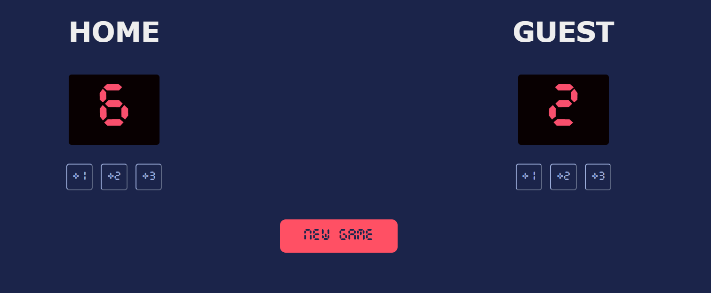

# 🏀 Basketball Score Card

Deployed site: https://scorecard-basketball-1.netlify.app/

A simple basketball score tracker built using **HTML**, **CSS**, and **JavaScript**.  
This project allows you to keep track of the scores for two teams, with buttons to add points quickly.

---

## 📸 Preview
    
---

## ✨ Features
- Track scores for **Home** and **Guest** teams.
- Buttons to increment scores by **+1**, **+2**, or **+3** points.
- Custom digital-style font for scoreboard display.
- Clean and responsive layout.

---

## 🛠️ Technologies Used
- **HTML5**
- **CSS3**
- **JavaScript (ES6)**
- **Custom TTF Font** for scoreboard

---

## 📂 How to Use
1. Clone or download the repository.
2. Open `index.html` in your browser.
3. Use the buttons to update scores for each team.

---

## 🎓 Acknowledgements
This project was created as part of a **Scrimba** tutorial:  
[Scrimba Frontend Developer Career Path](https://scrimba.com/)

The original idea and design are from Scrimba’s basketball scorecard challenge.  
I built this project while following the course.

---

## 📄 License
This project is for learning purposes only.  
The design and concept are credited to **Scrimba**.